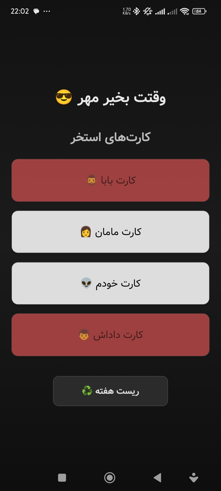

# 🌊 Splash Cards

سلام! این پروژه یک اپلیکیشن موبایل با **React Native و Expo** هست که کارت های عضویت استخر من رو مدیریت میکنه و اولین تجربه من برای برنامه نویسی موبایل هست به شکلی که من یادم میره چه کارت هایی رو استفاده کردم و بعد هر هفته جلالی تمام کارت ها دوباره قابل استفاده میشن و این ویژگی به صورت اتوماتیک وار با تقویم جلالی انجام میشه.🃏✨

---

## 📸 پیش‌نمایش برنامه

<div style="text-align:center;">
  
</div>


---

## 🚀 شروع سریع

### 1️⃣ نصب وابستگی‌ها

```bash
npm install
```

### 2️⃣ اجرای برنامه

```bash
npx expo start
```

بعد از اجرا می‌تونی برنامه رو روی:

- 📱 **گوشی اندروید خودت** (با Expo Go یا development build)
- 🖥️ **شبیه‌ساز اندروید/ iOS**
- 🌐 **وب**

باز کنی و تست کنی.

### 3️⃣ مسیر فایل‌ها

تمام کدهای اصلی داخل پوشه **app/** هست و پروژه از **file-based routing** استفاده می‌کنه.

---

## 🧹 ریست پروژه

اگه خواستی یه پروژه تمیز و تازه شروع کنی:

```bash
npm run reset-project
```

این دستور:

- کد فعلی رو به **app-example/** منتقل می‌کنه
- یه پوشه **app/** خالی می‌سازه تا از صفر شروع کنی

---

## 💡 ویژگی‌ها

- مدیریت کارت‌های استخر با ذخیره وضعیت در **AsyncStorage**
- تشخیص هفته جاری بر اساس **تقویم جلالی** 🗓️
- افکت‌ها و انیمیشن‌های جذاب روی کارت‌ها ✨
- دارک مود و طراحی مدرن 🌑
- فونت فارسی **وزیر** برای تجربه کاربری بهتر 🖋️

---

## 🛠️ پیش‌نیازها

- Node.js (نسخه 18 یا بالاتر توصیه میشه)
- Expo SDK 54
- اندروید استودیو یا شبیه‌ساز برای تست

---

## 📚 یادگیری بیشتر

- [مستندات Expo](https://docs.expo.dev)
- [React Native](https://reactnative.dev/)
- [Jalaali.js برای تقویم جلالی](https://github.com/jalaali/jalaali-js)

---

## 🌐 جامعه و پشتیبانی

- [کانال Discord Expo](https://chat.expo.dev) برای سوالات و کمک
- [گیت‌هاب Expo](https://github.com/expo/expo) برای مشارکت و مشاهده کدهای متن‌باز

---

💌 از استفاده و توسعه پروژه لذت ببر!

```

```
